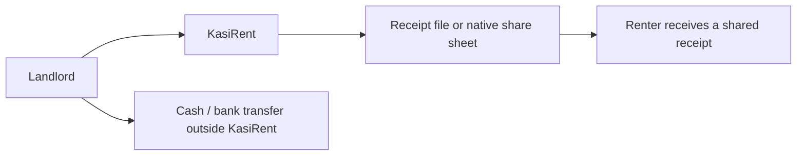
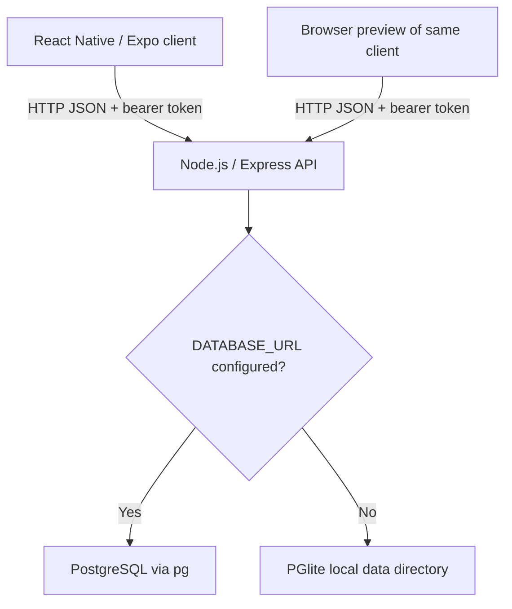
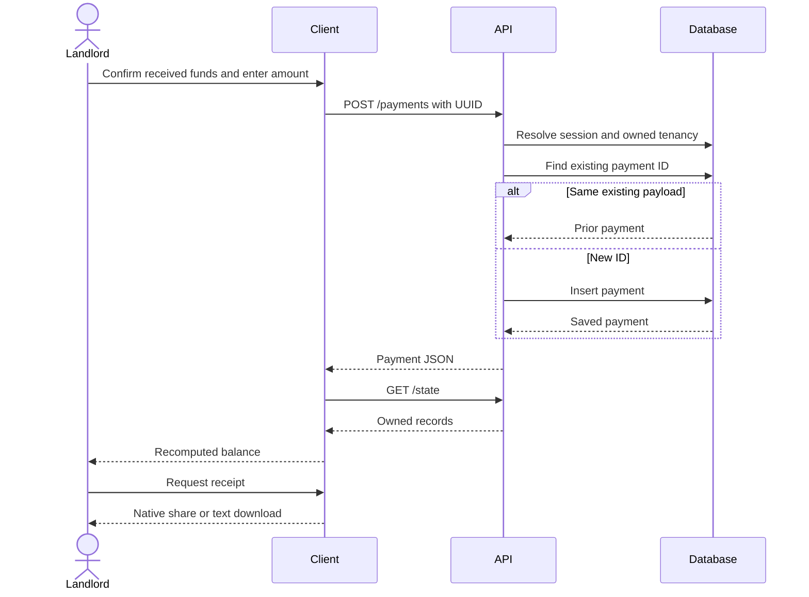

# KR-ARC-001 — C4 and Sequence Views

## Document control

| Field | Value |
| --- | --- |
| Document ID | KR-ARC-001 |
| Version / date | 0.1.0 / 2026-09-07 |
| Status | Draft — review pending |
| Owner | Engineering |
| Product baseline | Local MVP; planned capabilities explicitly identified |

## Revision history

| Version | Date | Description |
| --- | --- | --- |
| 0.1.0 | 2026-09-07 | Initial KasiRent documentation baseline. |

## Executive summary

Show the system boundary, running containers and payment flow.

## Scope

These are lightweight Mermaid context/container views, not a claim of formal C4 notation conformance. Solid nodes below exist; future facilities are discussed in the deployment document rather than drawn as running services.

## System context

The renter has no login and the bank is not integrated. Receipt delivery is performed by the landlord outside the API.

## Container view

## Record payment sequence

The diagram shows a successful sequential request. Validation errors return before insertion. Concurrent insert collisions, partial state reads and receipt delivery failures need separate handling and are not hidden by this view.

## References

- [KR-SAD-001 — Software Architecture Document](KR-SAD-001-Software-Architecture-Document.md)
- [KR-ADS-001 — API Design Specification](../06-API/KR-ADS-001-API-Design-Specification.md)
