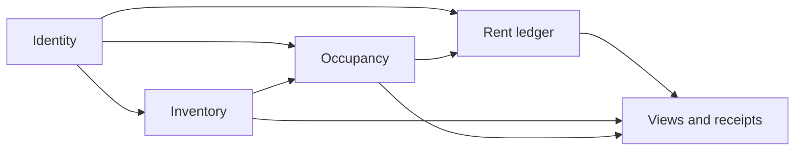

# KR-DOM-002 — Bounded Context Map

## Document control

| Field | Value |
| --- | --- |
| Document ID | KR-DOM-002 |
| Version / date | 0.2.0 / 2026-09-08 |
| Status | Draft — review pending |
| Owner | Engineering |
| Product baseline | Local MVP; planned capabilities explicitly identified |

## Revision history

| Version | Date | Description |
| --- | --- | --- |
| 0.2.0 | 2026-09-08 | Tenancy lifecycle, migration and current verification. |
| 0.1.0 | 2026-09-07 | Initial KasiRent documentation baseline. |

## Executive summary

Define proposed code ownership boundaries without claiming they are implemented modules.

## Contexts

| Context | Owns | Consumes | Boundary rule |
| --- | --- | --- | --- |
| Identity | Accounts and sessions | None | Exposes authenticated owner identity, never password material |
| Inventory | Properties and rooms | Owner identity | Validates property ownership before room creation |
| Occupancy | Tenancy and rental terms | Owned room | Cannot attach to another owner's room |
| Rent ledger | Charges, payments and reversals | Owned tenancy and current terms | Money history is authoritative |
| Presentation/reporting | Derived views and receipt text | Owner-scoped records | Currently client code; does not authorize writes |
| Operations | Configuration and recovery procedures | All stored categories | Access is operationally restricted |

These are logical boundaries for refactoring. Today most server logic is in server/app.mjs, with occupancy/charging in server/tenancies.mjs. There is no event transport.

## Context relationships

## Integration rules

Pass IDs and explicit contracts between contexts. The ledger must validate tenancy ownership itself, even when a UI has already filtered choices. Copy the charged amount into each charge; never calculate historical rent using only the current tenancy rent.

Future maintenance and notification modules should consume narrowly scoped records or events. Do not give an external messaging provider full landlord state.

## References

- [KR-DOM-004 — Domain Model](KR-DOM-004-Domain-Model.md)
- [KR-SAD-001 — Software Architecture Document](../03-Architecture/KR-SAD-001-Software-Architecture-Document.md)
