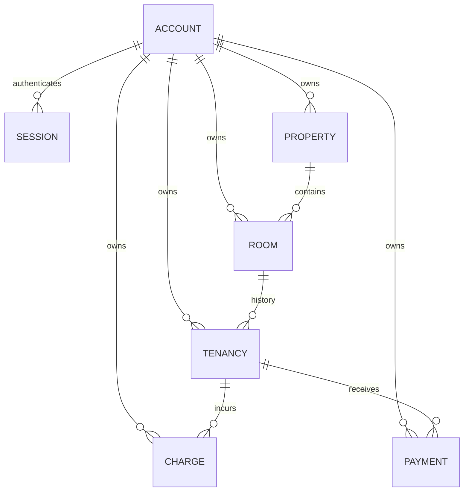

# KR-DOM-004 — Domain Model

## Document control

| Field | Value |
| --- | --- |
| Document ID | KR-DOM-004 |
| Version / date | 0.3.0 / 2026-09-08 |
| Status | Draft — review pending |
| Owner | Engineering |
| Product baseline | Local MVP; planned capabilities explicitly identified |

## Revision history

| Version | Date | Description |
| --- | --- | --- |
| 0.2.0 | 2026-09-08 | Tenancy lifecycle, migration and current verification. |
| 0.3.0 | 2026-09-08 | Align with effective-month rent changes. |
| 0.1.0 | 2026-09-07 | Initial KasiRent documentation baseline. |

## Executive summary

Describe entities, relationships and history constraints.

## Current entity model

All business rows explicitly carry owner. Parent foreign keys enforce existence, while API checks enforce that parent and child belong to the same account. There are no composite owner/ID foreign keys.

## Identity and lifecycle

Account identity is a text UUID generated on the server. Session token hashes identify revocable seven-day sessions. A property groups rooms. A tenancy stores renter details directly; there is no separate renter-profile entity.

A charge captures a fixed amount and month. A payment captures amount, method, received date, reference and created time. Its reversal fields change once through the supported endpoint. Balances and receipts are derived, not tables.

## Occupancy history

A partial unique index permits one active tenancy per room. Ended records remain. start_on is inclusive and end_on is the last occupied day; the next active tenancy must start later. Room-locked API transactions prevent overlapping replacement dates. Direct SQL must not bypass these rules.

## Planned extension

Effective-dated rent terms are implemented in rent_changes. Model future adjustments and receipt snapshots explicitly. A future deposit ledger must be separate from rent. Each change needs migrations, overlap rules, reconciliation examples and tests before it becomes a new baseline.

## References

- [KR-DDS-001 — Database Design Specification](../05-Database/KR-DDS-001-Database-Design-Specification.md)
- [KR-DOM-008 — State Transition Models](KR-DOM-008-State-Transition-Models.md)
