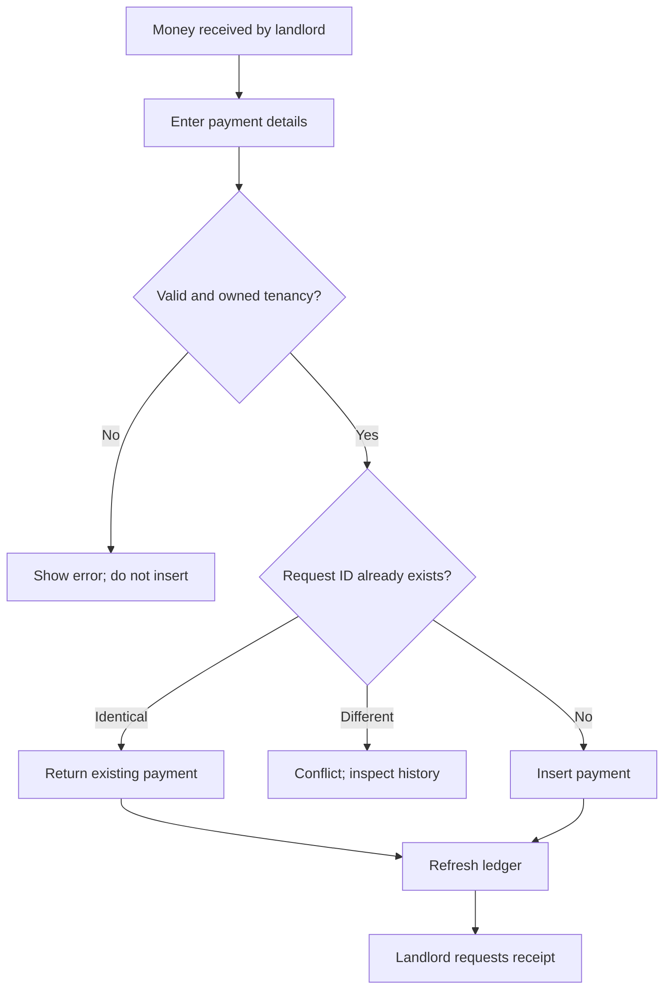

# KR-DOM-007 — Business Process Catalogue

## Document control

| Field | Value |
| --- | --- |
| Document ID | KR-DOM-007 |
| Version / date | 0.1.0 / 2026-09-07 |
| Status | Draft — review pending |
| Owner | Product owner and engineering |
| Product baseline | Local MVP; planned capabilities explicitly identified |

## Revision history

| Version | Date | Description |
| --- | --- | --- |
| 0.1.0 | 2026-09-07 | Initial KasiRent documentation baseline. |

## Executive summary

Connect operations to rules, inputs and resulting records.

## Process catalogue

| Process | Trigger | Inputs | Main steps | Output / related rules |
| --- | --- | --- | --- | --- |
| BP-001 Onboard landlord | New account | Name, email, password | Validate → create account → create session → load empty state | Account/session; RULE-001 |
| BP-002 Prepare rental inventory | New property/room | Address and room name | Verify owner → create property → create room | Property/room; RULE-002, RULE-003 |
| BP-003 Assign renter | Room ready | Renter and terms | Select owned room → validate terms → insert tenancy | Tenancy; RULE-004, RULE-012 |
| BP-004 Prepare monthly ledger | Rent period chosen | Month | Find eligible tenancies → insert missing charges → refresh | Charges; RULE-005 |
| BP-005 Record rent receipt | Funds received | Tenancy, amount, date, method, reference, UUID | Validate owner → check replay → insert → refresh → share receipt | Payment; RULE-006, RULE-007, RULE-010 |
| BP-006 Correct entry | Mistake found | Payment and reason | Verify active owned entry → reverse → optionally replace | Preserved original; RULE-008 |
| BP-007 Review period | Landlord review | Recorded charges/payments plus external evidence | Check completeness → compare amounts → investigate differences | Explained balance; RULE-009 |

## Payment process

## Exceptions and controls

If a save succeeds but refresh fails, the ledger may be stale. Inspect saved history before entering another payment with a new ID. Monthly charging now runs transactionally; retrying the same month does not duplicate charges. Room locks coordinate it with move-in/out.

The month in a payment reference is descriptive text. There is no formal allocation between a payment and a particular charge. Partial receipts reduce the tenancy's total balance.

These are process diagrams, not BPMN executable workflows. Proposed events in KR-DOM-006 are not currently emitted by any process.

## References

- [KR-USE-001 — Use Cases](../02-Requirements/KR-USE-001-Use-Cases.md)
- [KR-DOM-005 — Business Rules Catalogue](KR-DOM-005-Business-Rules-Catalogue.md)
- [KR-DOM-006 — Domain Events Catalogue](KR-DOM-006-Domain-Events-Catalogue.md)
