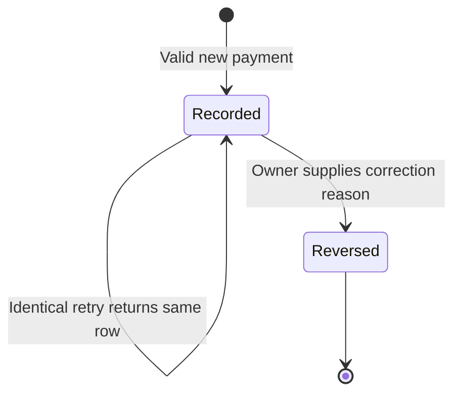

# KR-DOM-008 — State Transition Models

## Document control

| Field | Value |
| --- | --- |
| Document ID | KR-DOM-008 |
| Version / date | 0.2.0 / 2026-09-08 |
| Status | Draft — review pending |
| Owner | Engineering |
| Product baseline | Local MVP; planned capabilities explicitly identified |

## Revision history

| Version | Date | Description |
| --- | --- | --- |
| 0.2.0 | 2026-09-08 | Tenancy lifecycle, migration and current verification. |
| 0.1.0 | 2026-09-07 | Initial KasiRent documentation baseline. |

## Executive summary

Define supported transitions and avoid destructive history changes.

## Payment lifecycle

Recorded means voided_at is null. Reversed means it is set with void_reason. There is no pending/settled gateway state and no supported reversal rollback. A replacement is a new payment linked operationally by its reference; no formal replacement foreign key exists.

## Session lifecycle

A successful login or registration creates a session. It is usable until expiry or logout. Expiry is checked during access but does not automatically delete the row. Session cleanup and logout-all are future work.

## Room and tenancy lifecycle

Available/occupied are derived from active tenancies (end_on is null). Record move-out transitions occupied → available, preserving the old tenancy. A later replacement transitions available → occupied.

**Implemented:** active tenancy → ended tenancy, followed by a new active tenancy where date intervals do not overlap. Ending a tenancy must preserve all charges and payments. Cancellation, deposits and refund outcomes need separate rules.

## Charge and receipt lifecycle

Charges are created once per tenancy/month; no update, reversal or deletion endpoint exists. Text receipts are regenerated from live client records. There is no persisted issued/superseded receipt state. Those are design gaps, not hidden states.

Test each new transition's allowed predecessor, owner checks, duplicate request behaviour and financial effect before enabling it.

## References

- [KR-DOM-004 — Domain Model](KR-DOM-004-Domain-Model.md)
- [KR-DOM-005 — Business Rules Catalogue](KR-DOM-005-Business-Rules-Catalogue.md)
